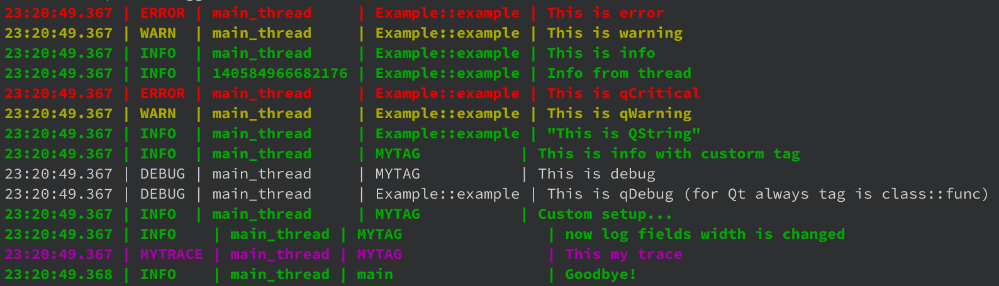

# logger

Very efficient, convenient, thread-safe, flexible and simple logger with Qt support (if enabled)  
Requires C++17 and higher.

Features:
* Stream and formatted input
* Many destinations 
* Coloured console output 
* Log levels, types, tags
* Extremely small overhead for disabled debug
* Catch Qt messages (if enabled)
* Custom output format
* Custom messages types
* Filter by type

[Example](tests/main.cpp)

To use Logger within your software project include the Logger source into your project

Source:
* logger.h/cpp - logger and base stuff
* logdefdest.h/cpp - default destinations for console and file 
* log_base.h - macro for simple use logger
* logstream.h - log stream, it can be used to add output operator for your types, (see [src/logstream.h](src/logstream.h))
* funcinfo.h - macros for parsing signatures

or include `logger.cmake` in the cmake project

It is also recommended to add your `log.h` file to your project (see [tests/log.h](tests/log.h))

   
## ChangeLog

### v1.3
* Added useful macros
* Improved parsing of function signatures
* Removed rotate from FileLogDest (now files management should be outside)

### v1.2
* Added coloured console output (thanks [Hemant Antony](https://github.com/HemantAntony))

### v1.1
* Added formatted input (thanks [Elnur Ismailzada](https://github.com/Eism))

### v1.0
* Ported from [https://github.com/igorkorsukov/qzebradev](https://github.com/igorkorsukov/qzebradev)
